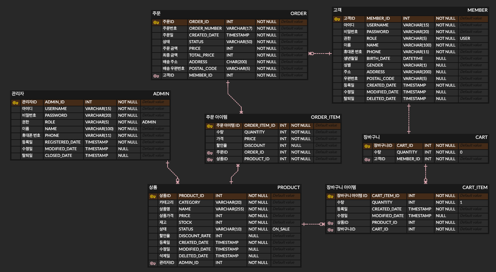
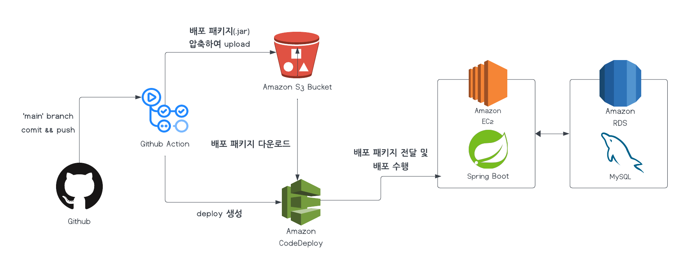

# 커머스 프로젝트 🛍️

장바구니 기능을 구현한 프로젝트 입니다.

## 주요 기능
### [🔗 Swagger](http://43.201.145.62:8080/swagger-ui/index.html)

- 회원가입, 로그인
- 상품 등록 / 수정 / 삭제 / 조회
- 장바구니 추가 / 수정 / 삭제

## ERD

 
 

## 시스템 아키텍처

 
 

## 기술 스택

## API

| API 그룹      | 엔드포인트                                                             | HTTP 메서드 | 설명          |
|-------------|-------------------------------------------------------------------|----------|-------------|
| 회원 관리 API   | /join                                                             | POST     | 회원가입        |
|             | /login                                                            | POST     | 로그인         |
| 상품 관리 API   | /api/products                                                     | POST     | 상품 등록       |
|             | /api/products/{id}                                                | GET      | 상품 상세 조회    |
|             | /api/products/{id}                                                | PUT      | 상품 수정       |
|             | /api/products/{id}                                                | DELETE   | 상품 삭제       |
|             | /api/products?keyword= &page=&category=&min-price=&max-price= | GET      | 상품 검색       |
| 장바구니 관리 API | /api/user/{user_id}/carts                                         | POST     | 장바구니 추가     |
|             | /api/user/{user_id}/carts                                         | GET      | 장바구니 조회     |
|             | /api/user/{user_id}/carts/{cart_item_id}                          | PUT      | 장바구니 아이템 수정 |
|             | /api/user/{user_id}/carts/{cart_item_id}                          | DELETE   | 장바구니 아이템 삭제 |

## 유스 케이스

### [유스 케이스 보기](https://github.com/jexnjeux/cart-project/wiki/%EC%9C%A0%EC%8A%A4-%EC%BC%80%EC%9D%B4%EC%8A%A4)