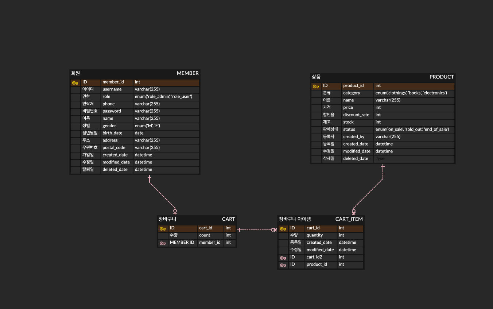

# 장바구니 프로젝트 🛒

상품을 등록하고, 등록된 상품을 장바구니에 담는 기능을 구현한 프로젝트입니다.

## ERD

## 프로젝트 기능

**회원가입**
- 아이디, 비밀번호, 이름, 휴대폰번호, 주소, 우편번호의 정보가 필수적으로 필요하다.
- 생년월일과 성별 정보는 선택적으로 입력 가능하다.
- 이미 가입된 아이디로 회원가입을 시도할 경우 에러가 발생한다.
- 패스워드는 영문과 숫자의 조합으로 구성되어야 하며, 이를 충족하지 못할 경우 에러가 발생한다.

**로그인**
- 가입되어있지 않는 아이디로 로그인을 요청할 경우 에러가 발생한다.
- 비밀번호가 일치하지 않는 경우 에러가 발생한다.

**상품 등록 / 수정 / 삭제**
- 관리자 로그인 후 이용 가능하다.
- 본인이 등록한 상품에 대해서만 수정과 삭제가 가능하다.

**상품 조회**
- 로그인을 하지 않아도 이용 가능하다.
- 상품명, 가격대, 카테고리로 조회가 가능하다.
- 검색어를 포함하고 있는 상품을 조회하여 페이징된 상품 정보를 반환한다.

**장바구니 등록 / 수정 / 삭제**
- 로그인 후 이용 가능하다.
- 본인의 장바구니만 이용 가능하다.

## 기술 스택

